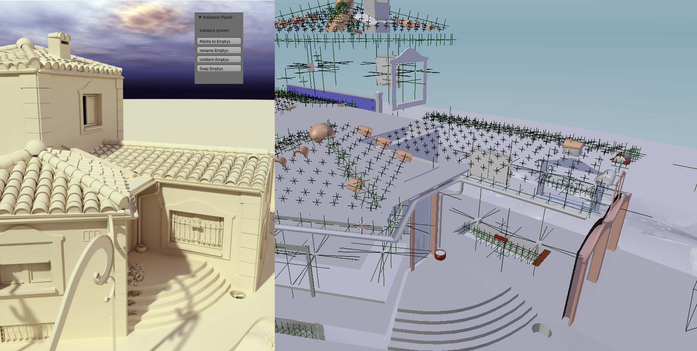

# Convert Mesh to emptys

## Welcome! 👋

When displaying 3d scenes, in webGl we use instances to reduce gpu drawing calls.

Blender instances are not supported when exporting to obj or other formats.

That's why I made this script.

We select all identical objects and click on "mesh to empty".

The first object will remain intact while all the others will become object emptys with the scale, rotation and position kept and will take the name of the first object.

Thus, when exporting and loading in the browser, it will be enough to search by name to replace the emptys by the topology concerned.

This script only works in Blender 2.79 and must be updated for new versions.

Translated with www.DeepL.com/Translator (free version)

**Have fun !** 🚀